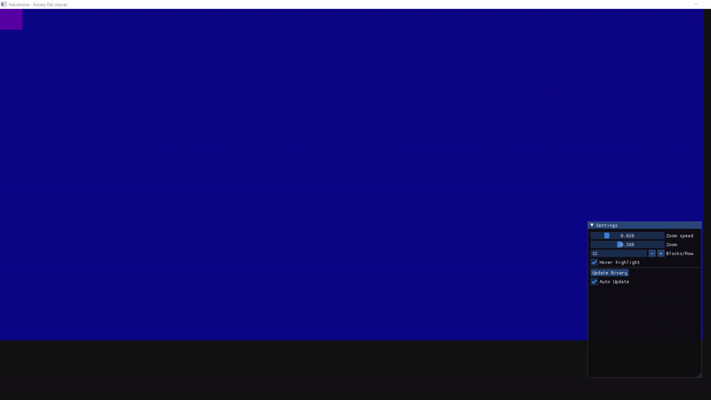

# hexamine
hexamine is a graphical viewer for binary files using [SFML](https://github.com/SFML/SFML) and [Dear ImGui](https://github.com/ocornut/imgui)



## Features
- Binary file visualization
- Zoom and byte ordering options
- Autoupdate after file change (see [Limitations](#limitations))
- Highlight bytes on hover
- Different colormaps (ToDo)
- Textual byte and ASCII viewer (ToDo)
- Traverse file with mouse dragging (ToDo)

## How to use
Download and run `hexamine.exe` from your command line. Pass the path to your binary file as the first argument:
```sh
.\hexamine.exe <path-to-bin>
```

## How to build
SFML backend support for ImGui is archieved with [ImGui SFML](https://github.com/SFML/imgui-sfml). The cmake files were taken from this [ImGui Fetchcontent example](https://github.com/eliasdaler/imgui-sfml-fetchcontent).\
You can add and build your own changes. Thanks to the the cmake dependencies everything is downloaded automatically. \
Simply run the following commands to build:

```sh
mkdir build
cd build
cmake <path-to-cloned-repo> -D LINK_DEPS_STATIC=ON
cmake --build .
.\src\Debug\hexamine.exe
```

## Limitations
- Trying to view large files at once causes performace issues, use of offset suggested
- The autoupdate interval is OS dependant as it checks for the last file change (1 second resolution on Windows) 
