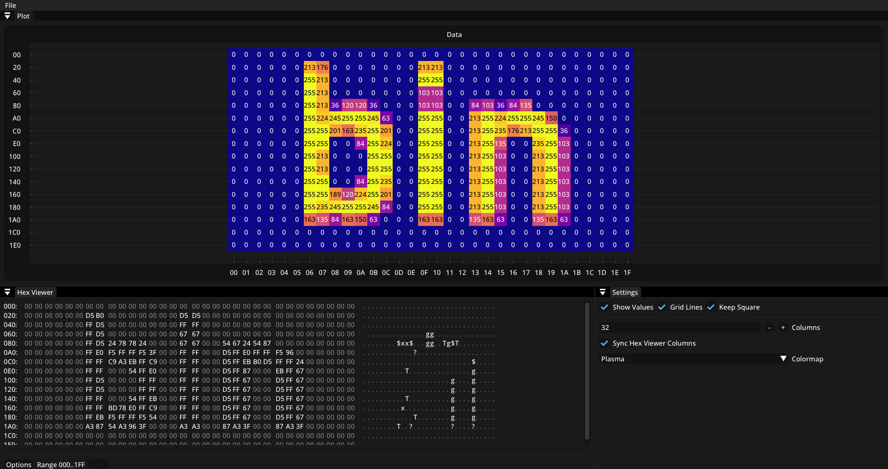

# hexamine
hexamine is a graphical viewer for binary files using [SFML](https://github.com/SFML/SFML), [Dear ImGui](https://github.com/ocornut/imgui) and [ImPlot](https://github.com/epezent/implot).



## Features
- Binary file visualization
- Zoom and byte ordering options
- Autoupdate after file change (see [Limitations](#limitations))
- Textual byte and ASCII viewer
- Traverse file with mouse dragging

## How to use
Download and run `hexamine.exe` from your command line. Pass the path to your binary file as the first argument:
```sh
.\hexamine.exe <path-to-bin>
```

## Limitations
- The autoupdate interval is OS dependent as it checks for the last file change (1 second resolution on Windows) 
